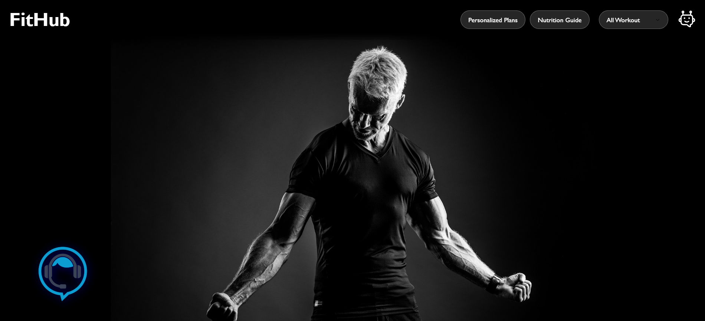

# FitHub - AI Powered Fitness Trainer 🏋️‍♂️

A comprehensive, modern fitness web application featuring AI-powered chatbot assistance, voice-controlled virtual assistant, personalized workout plans, and nutrition guidance.

## 🖼️ Main Dashboard



**The main dashboard features:**
- Clean, modern interface with FitHub branding
- AI-powered chatbot "Chitti🤖" for fitness assistance
- Voice-controlled virtual assistant for hands-free operation
- Personalized workout plans and nutrition guidance
- Professional footer with social media integration
- Responsive design that works on all devices

## ✨ Features

### 🏠 Main Dashboard
- **Professional Navigation**: Clean white FitHub logo with smooth dropdown menu
- **Header Features**: Quick access to Personalized Plans and Nutrition Guide
- **Workout Classifier**: Easy navigation between different workout categories
- **AI Chatbot**: "Chitti🤖" - Your personal fitness assistant
- **Voice Assistant**: Hands-free navigation and workout guidance
- **Professional Footer**: Complete with social media links and contact information

### 💪 Personalized Workout Plans
- **Comprehensive Form**: Age, gender, height, weight, goals, experience level, equipment, injuries
- **AI-Powered Logic**: Rule-based workout plan generation based on user inputs
- **Multiple Goals**: Weight loss, muscle gain, endurance, strength, general fitness
- **Equipment Adaptation**: Plans adapt to available equipment (bodyweight, dumbbells, machines)
- **7-Day Schedule**: Detailed weekly workout plans with sets, reps, and rest times
- **BMI Calculation**: Automatic BMI calculation and health metrics
- **Professional UI**: Modern form design with validation and responsive layout

### 🥗 Nutrition Guide
- **Advanced Calculator**: BMR and TDEE calculations using Mifflin-St Jeor equation
- **Macro Tracking**: Protein, carbs, fats with customizable ratios
- **Dietary Preferences**: Support for omnivore, vegetarian, vegan, keto, paleo, Mediterranean
- **Meal Planning**: 7-day meal plans with breakfast, lunch, dinner, and snacks
- **Goal-Based Nutrition**: Adjusts calories and macros for weight loss, muscle gain, or maintenance
- **Allergy Considerations**: Takes food allergies into account for meal planning
- **Scientific Calculations**: Real nutritional formulas for accurate recommendations

### 💬 Intelligent Chatbot
- **Powered by Gemini AI**: Advanced natural language processing
- **Fitness Expert**: Specialized responses for workout and nutrition queries
- **Demo Mode**: Fallback responses when API is rate-limited
- **Professional UI**: Modern chat interface with message labels and smooth animations
- **Footer Integration**: Accessible from footer links on all pages

### 🎤 Voice Assistant
- **Speech Recognition**: Voice commands for navigation
- **Text-to-Speech**: Spoken responses and guidance
- **Smart Commands**: Open/close chat, navigate pages, get workout info
- **Hands-Free Operation**: Perfect for during workouts
- **Footer Integration**: Quick access from footer feature links

### 📱 Responsive Design
- **Mobile-First**: Optimized for all screen sizes
- **Modern UI**: Clean, professional interface with smooth transitions
- **Accessibility**: Keyboard navigation and screen reader friendly
- **Cross-Browser**: Works on Chrome, Firefox, Safari, Edge

### 🎨 Professional Footer
- **Comprehensive Links**: Quick links, features, contact information
- **Social Media**: Facebook, Twitter, Instagram integration
- **Modal System**: Professional popups for features and legal pages
- **Responsive Design**: Adapts to all screen sizes
- **Interactive Elements**: Hover effects and smooth animations

## 🏋️ Workout Pages

### Individual Workouts
- **Back Workout**: Comprehensive back exercises and routines
- **Chest Workout**: Chest-focused training programs
- **Biceps & Triceps**: Arm strengthening exercises
- **Shoulder Workout**: Shoulder development routines
- **Leg Workout**: Lower body training programs
- **All Workout**: Complete full-body training sessions

### Features per Page
- **Exercise Demonstrations**: Visual GIF guides for proper form
- **Header Navigation**: Consistent navigation with new features
- **Professional Footer**: Complete footer with all links
- **Clean Interface**: Focused workout experience without distractions
- **Easy Navigation**: Quick access between different workout types

## 🛠️ Technology Stack

### Frontend
- **HTML5**: Semantic markup and modern structure
- **CSS3**: Advanced styling with animations and transitions
- **Vanilla JavaScript**: No framework dependencies for fast loading
- **Responsive Design**: Mobile-first approach with CSS Grid/Flexbox

### AI Integration
- **Gemini API**: Google's advanced AI model for chatbot responses
- **Web Speech API**: Native browser speech recognition and synthesis
- **Rule-Based Logic**: Custom algorithms for workout and nutrition planning
- **RESTful API**: Clean API integration with error handling

### Design Features
- **CSS Variables**: Consistent theming and easy customization
- **Backdrop Filters**: Modern glassmorphism effects
- **Smooth Animations**: Professional transitions and micro-interactions
- **Custom Scrollbars**: Styled scrollbars for better UX
- **Modal System**: Dynamic popup generation with professional styling

## 🚀 Getting Started

### Prerequisites
- Modern web browser (Chrome, Firefox, Safari, Edge)
- Local web server (recommended)
- Internet connection for AI features

## 🚀 Installation & Setup

### 📋 Prerequisites
- **Modern web browser** (Chrome, Firefox, Safari, Edge)
- **Local web server** (recommended)
- **Internet connection** for AI features

### 📥 Repository Setup

#### **Option 1: Clone via Git**
```bash
# Clone the repository
git clone https://github.com/madhanmohanreddyperam06/AI-Fitness-Trainer.git

# Navigate to the project directory
cd AI-Fitness-Trainer

# Install dependencies (if any)
npm install
```

#### **Option 2: Download ZIP**
1. Click the green "Code" button on GitHub
2. Select "Download ZIP"
3. Extract the ZIP file to your desired location
4. Navigate to the extracted folder

#### **Option 3: Using GitHub CLI**
```bash
gh repo clone your-username/AI-Fitness-Trainer
```

### 🌐 Local Development Setup

#### **Method 1: Python Server**
```bash
# Navigate to project directory
cd AI-Fitness-Trainer

# Start Python's built-in server
python -m http.server 8000

# Alternative for Python 2
python -m SimpleHTTPServer 8000
```

#### **Method 2: Node.js Server**
```bash
# Install serve globally (if not already installed)
npm install -g serve

# Navigate to project directory
cd AI-Fitness-Trainer

# Start the server
npx serve .

# Or specify port
npx serve -p 8000
```

#### **Method 3: PHP Server**
```bash
# Navigate to project directory
cd AI-Fitness-Trainer

# Start PHP built-in server
php -S localhost:8000
```

#### **Method 4: Live Server (VS Code Extension)**
1. Install "Live Server" extension in VS Code
2. Right-click on `index.html`
3. Select "Open with Live Server"

#### **Method 5: Brackets Editor**
1. Open the project folder in Brackets
2. Go to File > Live Preview

### 🔧 Configuration

#### **Environment Variables**
Create a `.env` file in the root directory (optional):
```env
# API Configuration
API_KEY=your_api_key_here
API_BASE_URL=https://api.example.com

# Development Settings
DEBUG=true
PORT=8000
```

#### **Customization**
- **Colors & Themes**: Modify `styles/style.css`
- **Content**: Update HTML files in respective directories
- **Functionality**: Edit `script.js` for JavaScript features
- **Images**: Replace assets in `assets/` folder

### 🌐 Accessing the Application

Once the server is running, open your web browser and navigate to:
- **Local**: `http://localhost:8000` (or your configured port)
- **Network**: `http://your-local-ip:8000`

### 📱 Mobile Development

For mobile testing:
1. Use browser developer tools (F12) → Toggle device toolbar
2. Test on actual mobile devices on the same network
3. Ensure responsive design works across different screen sizes

### 🚀 Deployment

#### **Static Hosting Services**
- **Netlify**: Drag and drop the project folder
- **Vercel**: Connect your GitHub repository
- **GitHub Pages**: Enable in repository settings
- **Firebase Hosting**: Use Firebase CLI to deploy
- **Surge.sh**: `surge --domain yourdomain.com` in project folder

#### **Traditional Hosting**
- Upload files to your web server via FTP/SFTP
- Ensure all paths are correctly maintained
- Test all functionality after upload

4. **Open your browser** and navigate to:
   ```
   http://localhost:8000
   ```

### API Configuration

To enable the AI chatbot features:

1. **Get Gemini API Key**:
   - Visit [Google AI Studio](https://aistudio.google.com/)
   - Create a free account
   - Generate an API key

2. **Update API Key**:
   - Open `script.js`
   - Replace the existing API key in line 84:
   ```javascript
   let Api_url = "https://generativelanguage.googleapis.com/v1beta/models/gemini-2.0-flash:generateContent?key=YOUR_API_KEY_HERE";
   ```

## 📁 Project Structure

```
AI-Powered Fitness Trainer/
├── index.html                    # Main dashboard page
├── pages/                        # All sub-pages
│   ├── workout.html             # All workouts overview
│   ├── back.html                # Back workout page
│   ├── chest.html               # Chest workout page
│   ├── biceps-triceps.html      # Arms workout page
│   ├── shoulder.html            # Shoulder workout page
│   ├── leg.html                 # Leg workout page
│   ├── personalized-plans.html  # Personalized workout plans
│   └── nutrition-guide.html     # Nutrition guide and calculator
├── styles/
│   └── style.css                # Main stylesheet
├── script.js                    # JavaScript functionality
├── README.md                    # This file
├── favicons/                    # Website icons
│   ├── favicon.ico
│   ├── apple-touch-icon.png
│   └── ...
└── assets/                      # Images and media
   ├── *.gif                     # Exercise demonstration GIFs
   ├── *.svg                     # Icons and graphics
   └── *.png                     # UI elements
```

## 🎯 How to Use

### Main Dashboard
1. **Select Workout**: Use the dropdown menu to choose workout type
2. **Personalized Plans**: Click "Personalized Plans" for custom workout routines
3. **Nutrition Guide**: Click "Nutrition Guide" for dietary planning
4. **Chat with Chitti**: Click the chatbot icon to ask fitness questions
5. **Voice Commands**: Click the AI assistant for voice navigation

### Personalized Workout Plans
1. **Fill Form**: Enter personal information (age, gender, height, weight)
2. **Set Goals**: Choose fitness goal and experience level
3. **Select Equipment**: Check available equipment
4. **Generate Plan**: Click "Generate My Workout Plan"
5. **View Schedule**: Get detailed 7-day workout plan with exercises

### Nutrition Guide
1. **Enter Details**: Personal information and activity level
2. **Choose Diet**: Select dietary preferences (vegetarian, vegan, etc.)
3. **Set Goals**: Weight loss, muscle gain, or maintenance
4. **Calculate**: Get BMR, TDEE, and macro breakdown
5. **Meal Plan**: Receive 7-day meal suggestions

### Chatbot Features
- **Ask Questions**: "What are good exercises for beginners?"
- **Get Advice**: "How do I lose weight effectively?"
- **Workout Help**: "Show me chest exercises"
- **Nutrition Tips**: "What should I eat before a workout?"
- **Plan Help**: "Create a workout plan for weight loss"

### Voice Commands
- "Open chat" - Opens the chatbot
- "Close chat" - Closes the chatbot
- "Open [workout]" - Navigate to specific workout pages
- "Home" - Return to main dashboard
- "Personalized plans" - Open workout planner
- "Nutrition guide" - Open nutrition calculator

## 🔧 Customization

### Styling
- Edit `styles/style.css` to modify colors, fonts, and layouts
- CSS variables in `:root` for easy theme changes
- Responsive breakpoints for different screen sizes

### Content
- Update workout GIFs in the `/assets/` folder
- Modify exercise descriptions in HTML files
- Add new workout pages following the existing structure

### Workout Plans
- Customize workout logic in `pages/personalized-plans.html`
- Modify exercise databases and schedules
- Add new fitness goals and experience levels

### Nutrition Plans
- Update meal databases in `pages/nutrition-guide.html`
- Modify macro calculations and ratios
- Add new dietary preferences and meal options

### AI Responses
- Customize demo responses in `script.js`
- Modify API prompts for different response styles
- Add new fitness topics to the knowledge base

## 🌐 Browser Support

- **Chrome**: Full support with all features
- **Firefox**: Full support with all features
- **Safari**: Full support (Speech recognition may vary)
- **Edge**: Full support with all features
- **Mobile**: Responsive design works on all modern mobile browsers

## 📝 API Usage & Limits

### Gemini API
- **Free Tier**: 15 requests/minute, 1,000 requests/day
- **Paid Tier**: $0.00025 per 1,000 characters
- **Rate Limiting**: Automatic fallback to demo responses
- **Error Handling**: Graceful degradation when API is unavailable

## 🔍 Security & Privacy

- **No Data Collection**: All calculations happen client-side
- **Local Processing**: Personal data never leaves your browser
- **Secure API**: HTTPS connections for AI services
- **Privacy Compliant**: GDPR and privacy law friendly

## 🤝 Contributing

1. Fork the repository
2. Create a feature branch
3. Make your changes
4. Test thoroughly on multiple devices
5. Submit a pull request with detailed description

## 📄 License

This project is open source and available under the [MIT License](LICENSE).

## 🙋‍♂️ Support

For questions, issues, or suggestions:
- Check the existing issues
- Create a new issue with detailed description
- Include browser and device information for bugs
- Provide screenshots for UI issues

## 🎯 Current Features (✅ Completed)

- ✅ AI-powered chatbot with Gemini integration
- ✅ Voice-controlled virtual assistant
- ✅ Personalized workout plan generator
- ✅ Advanced nutrition calculator with meal planning
- ✅ Professional footer with social media integration
- ✅ Responsive design for all devices
- ✅ Modal system for features and legal pages
- ✅ Individual workout pages with exercise demonstrations
- ✅ BMR and TDEE calculations
- ✅ Macro nutrient tracking
- ✅ Multiple dietary preferences support
- ✅ Equipment-based workout adaptation
- ✅ BMI calculation and health metrics

## 🔮 Future Enhancements

- [ ] User profiles and progress tracking
- [ ] Video exercise demonstrations
- [ ] Social features and community
- [ ] Mobile app development
- [ ] Integration with fitness trackers
- [ ] Advanced AI coaching features
- [ ] Workout performance analytics
- [ ] Nutrition tracking and logging
- [ ] Integration with health apps
- [ ] Multi-language support

---

**Built with ❤️ for fitness enthusiasts**
